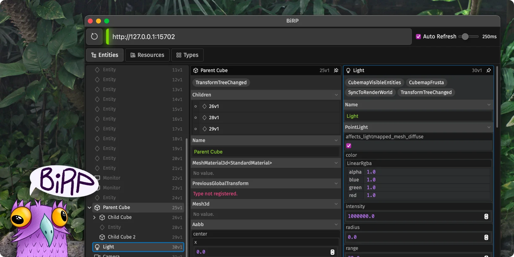

<div align="center">
  <h3 align="center">BiRP</h3>
  <p align="center"><em>a <a href="https://bevyengine.org" target="_blank">Bevy 0.16</a> remote protocol (BRP) inspector with *limited* editing capabilities built using <a href="https://dioxuslabs.com" target="_blank">Dioxus</a></em></p>
</div>

## Build BiRP

- Install the [Dioxus CLI](https://dioxuslabs.com/learn/0.6/getting_started/#install-the-dioxus-cli)
- Run the following command to build the app:
  ```sh
  dx bundle --release -p app_dx
  ```
- The binary will be located in `/app_dx/dist` directory.

## Configure Bevy

To enable the [Bevy Remote Protocol (BRP)](https://github.com/bevyengine/bevy/blob/main/examples/remote/server.rs) in your Bevy project, enable `bevy_remote` feature:

```toml
[dependencies]
bevy = { version = "0.16", features = ["bevy_remote"] }
```

Then add the following plugins to your game/app:

```rs
use bevy::remote::{http::RemoteHttpPlugin, RemotePlugin};

fn main() {
    App::new()
        .add_plugins(RemotePlugin::default()) // 👈 ADD THIS
        .add_plugins(RemoteHttpPlugin::default()) // 👈 ADD THIS
        .run();
}
```

## Development

To start the dev server, run:

```sh
dx serve -p app_dx
```
